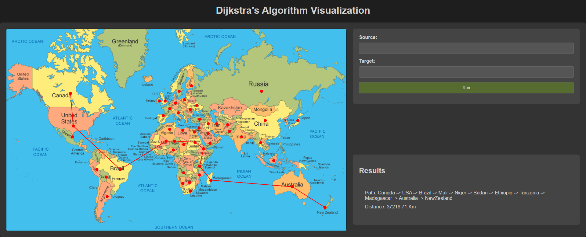

# Dijkstra's Algorithm Visualization

This repository contains a Flask application that visualizes Dijkstra's algorithm on a world map. The application allows users to select two countries and then calculates and displays the shortest path between them.

[](https://youtu.be/fLU4IQYtdTM)

## Main Features

- **Upload Map Data**: Users can upload a text file containing the map data. The file should contain the vertices (countries) and edges (connections between countries) of the map.

- **Select Source and Target**: Users can select the source and target countries either by clicking on the map or by typing the country name in the input fields. The input fields provide autocomplete functionality for ease of use.

- **Visualize Shortest Path**: Once the source and target countries are selected, the application runs Dijkstra's algorithm to find the shortest path between them. The path is then visualized on the map.

## Implementation Details

The application is implemented using Python and Flask for the backend, and HTML, CSS for the frontend.

### Frontend

The frontend provides the user interface for the application. It is implemented using HTML and CSS:

- `index.html`: This is the landing page of the application. It includes a file chooser for uploading the map data and a preview of the map image.
- `algorithm.html`: Contains the HTML structure of the application. It includes a map image, country buttons, input fields for selecting the source and target countries, and a canvas for visualizing the shortest path.
- `styles.css`: Contains the CSS styles for the application.

### Backend

The backend is responsible for reading the map data, running Dijkstra's algorithm, and serving the frontend. The main functionalities are implemented in the `Util.py` file:

The `Graph` and `MinHeap` classes were implemented from scratch without the use of external libraries. The `Graph` class represents the map and includes methods for adding vertices and edges. The `MinHeap` class is used to efficiently select the vertex with the smallest distance during the execution of Dijkstra's algorithm.

- `read_map(filename)`: Reads the map data from a file and returns a Graph object.
- `dijkstra(graph, start, end)`: Implements Dijkstra's algorithm to find the shortest path between two vertices in the graph.

The distance between two vertices is calculated using the Haversine formula, which is particularly useful for calculating the distance between two points on the Earth's surface specified in longitude and latitude. 

Here's the Python function used to calculate the distance:

```python
def distance(self, vertex1, vertex2):
    """Calculates the Haversine distance between two vertices."""
    lat1, lon1 = map(radians, self.vertices[vertex1])
    lat2, lon2 = map(radians, self.vertices[vertex2])

    # Haversine formula
    dlon = lon2 - lon1
    dlat = lat2 - lat1
    a = sin(dlat / 2) ** 2 + cos(lat1) * cos(lat2) * sin(dlon / 2) ** 2

    c = 2 * asin(sqrt(a))

    # Radius of earth in kilometers. Use 3956 for miles
    r = 6371

    # calculate the result
    return c * r
```

The Haversine formula calculates the shortest distance between two points on the surface of a sphere (in this case, the Earth). It first calculates the differences in longitude and latitude, then uses these differences to calculate a value `a` that incorporates the spherical nature of the Earth. The formula then calculates `c`, which is the angular distance between the two points in radians. Finally, it multiplies `c` by the radius of the Earth to get the distance in kilometers.


## Getting Started

To run the application locally, follow these steps:

1. Clone the repository.
2. Install the required Python packages: `pip install -r requirements.txt`
3. Run the Flask application: `python app.py`
4. Open a web browser and navigate to `http://localhost:5000`.

## Contributing

Contributions are welcome! Please feel free to submit a pull request.

## License

This project is licensed under the terms of the MIT license.

###### Rasheed Alqobbaj
